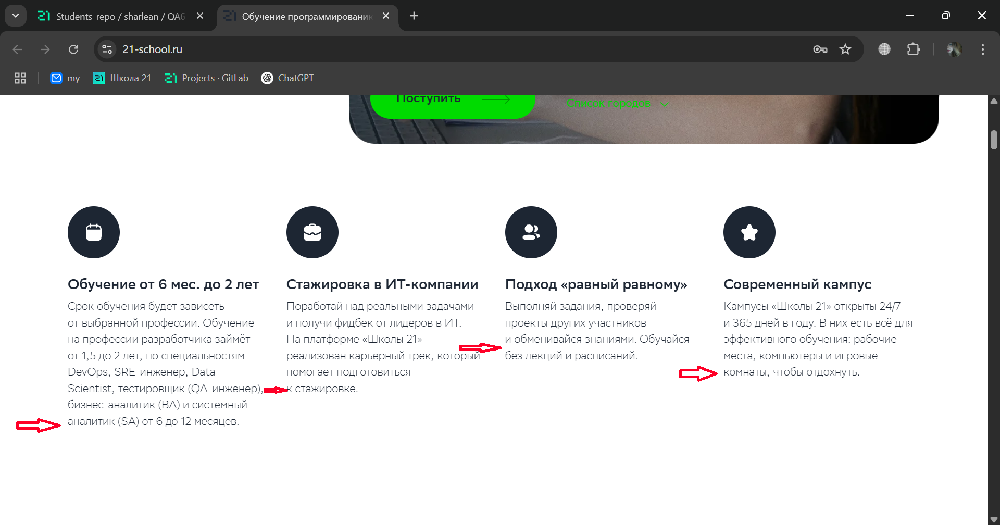
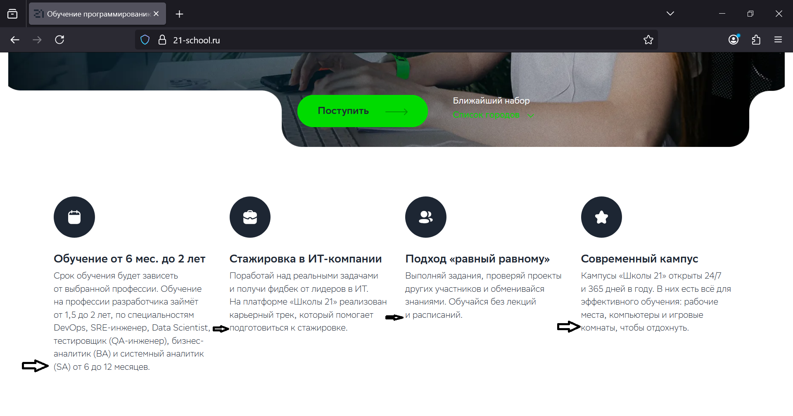
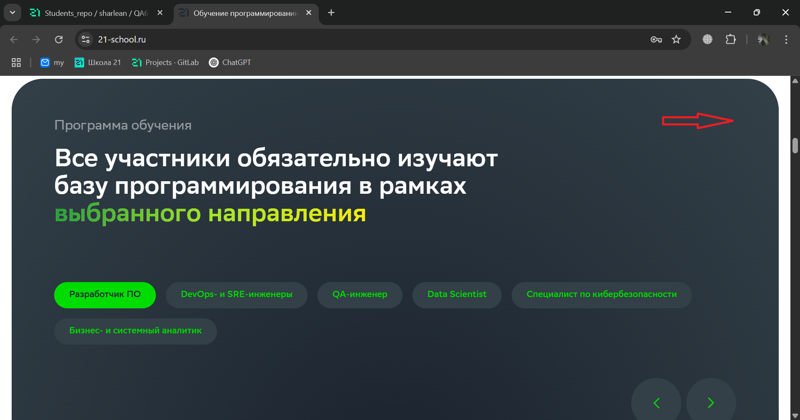
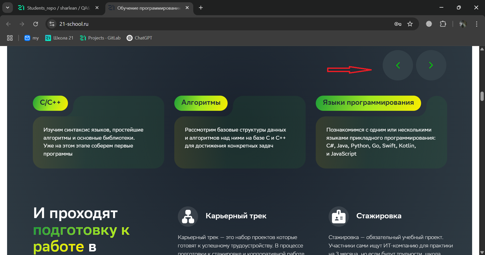
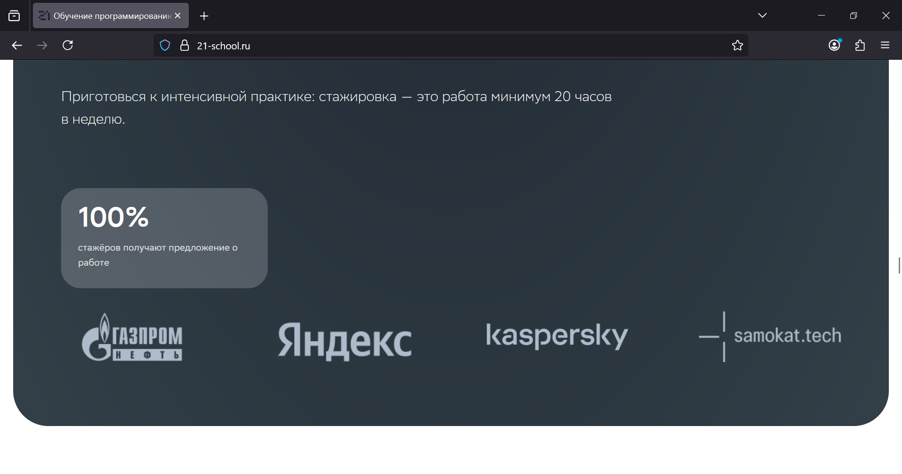
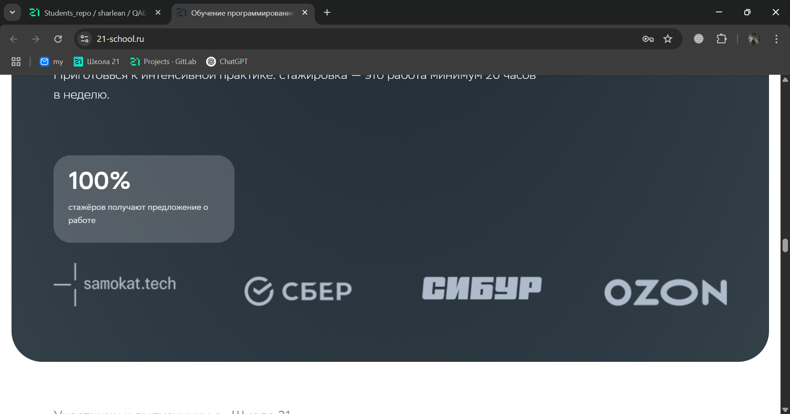
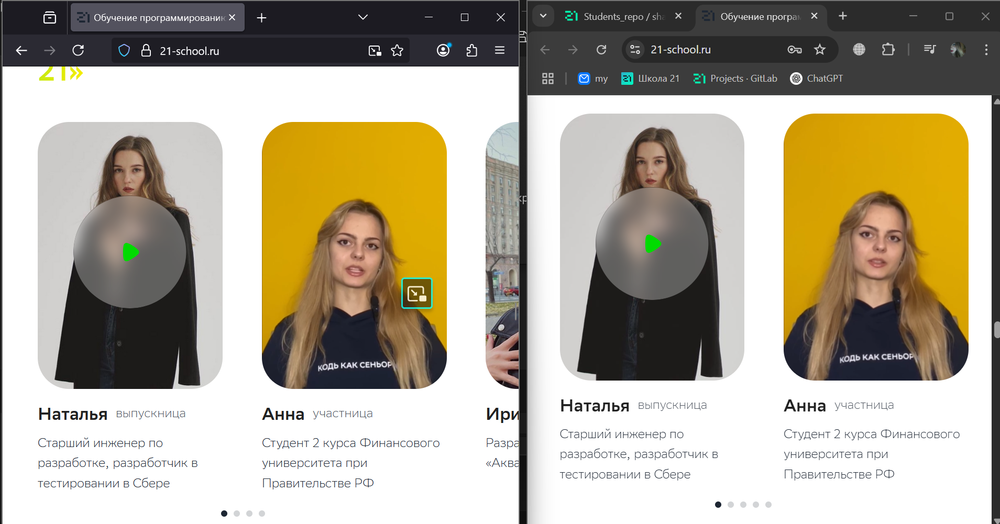
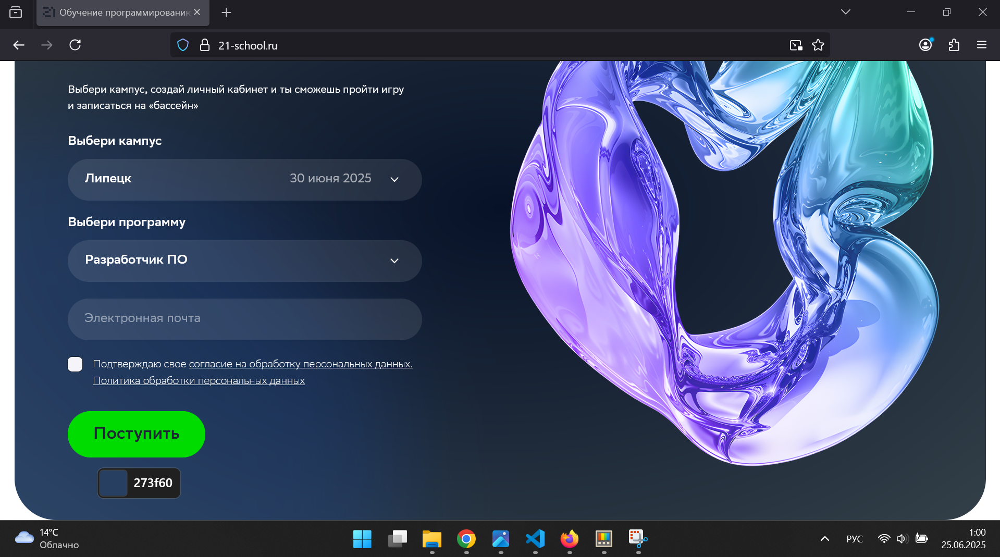
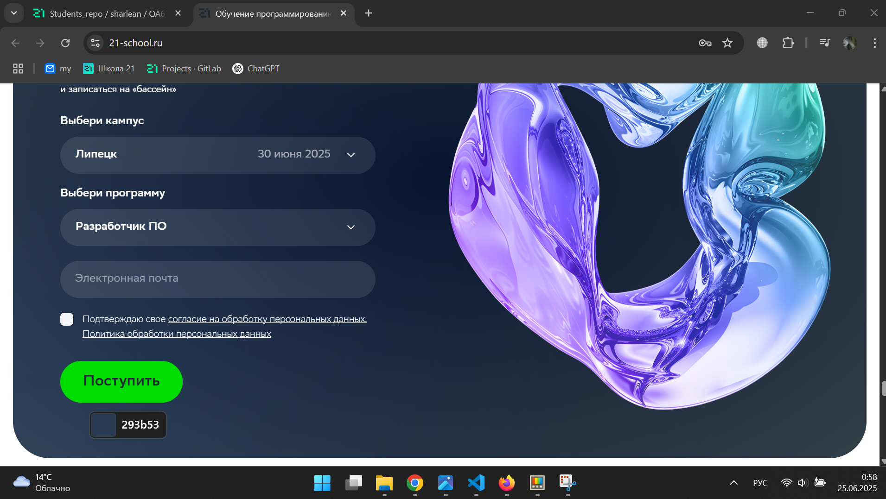

## Задание 3. Движки браузеров 

| Браузер | Рендеринг-движок | JavaScript-движок | Особенности                                    |
| ------- | ---------------- | ----------------- | ---------------------------------------------- |
| Chrome  | Blink            | V8                | Основан на Chromium. Быстр, часто обновляется. |
| Firefox | Gecko            | SpiderMonkey      | Свой движок. Независим от Chromium.            |
---
1. Разница в количестве строк. Это можно наблюдать в разных  областях страницы.

2. В Firefox угол в верхнем правом углу блока как будто впуклый — словно «вырезан» внутрь. А в Chrome угол обычный — прямой или слегка скруглённый, без «выреза».

  

3. В Chrome есть возможность прокрутить блоки с направлениями с помощью кнопок. В то время как в Firefox  такой возможности нет. 

  

4. Разница в  порядке отображении компаний спонсоров.

  

5. В плеере Firefox есть возможность  воспроизвести  видео в режиме "картинка в картинке".
  

6. Разница в градиенте (подтверждается кодом цвета).

---

### Возможные причины визуальной разницы:

1. **Свойство `border-radius` + `clip-path` или `mask`**
   Иногда дизайнеры делают спецэффекты, где один угол как бы вырезается внутрь.
   Chrome и Firefox **по-разному интерпретируют** такие эффекты.

2. **Разный рендеринг теней (`box-shadow`)**
   В Chrome тени и скругления иногда накладываются по-другому, создавая иллюзию впуклости.

3. **Браузерные баги или фичи**
   Иногда Chrome добавляет от себя сглаживание, а Firefox нет (или наоборот).
