## Задание 6. Тестирование UI веб-сайта

### 01. На главной странице отсутствует изображение из блока Mask Group (верхняя часть страницы)

---

**Шаги для воспроизведения:**

1. Открыть локальную версию сайта

---

**Ожидаемый результат:**
Верхняя часть страницы должна содержать изображение, размещённое в группе Mask Group согласно макету в Figma. Оно должно занимать ширину экрана и быть фоновым визуальным элементом (hero image).

**Фактический результат:** 
Изображение не отображается. Визуальный блок Mask Group отсутствует, в верхней части страницы — пустое пространство.

---

**Окружение:**

* **Устройство:** ноутбук
* **ОС:** Windows 11 Pro
* **Браузер:** Google Chrome 137.0.7151.104 (64 бит)

---

**Вложения:**

*  Скриншот текущего отображения (сайт) — 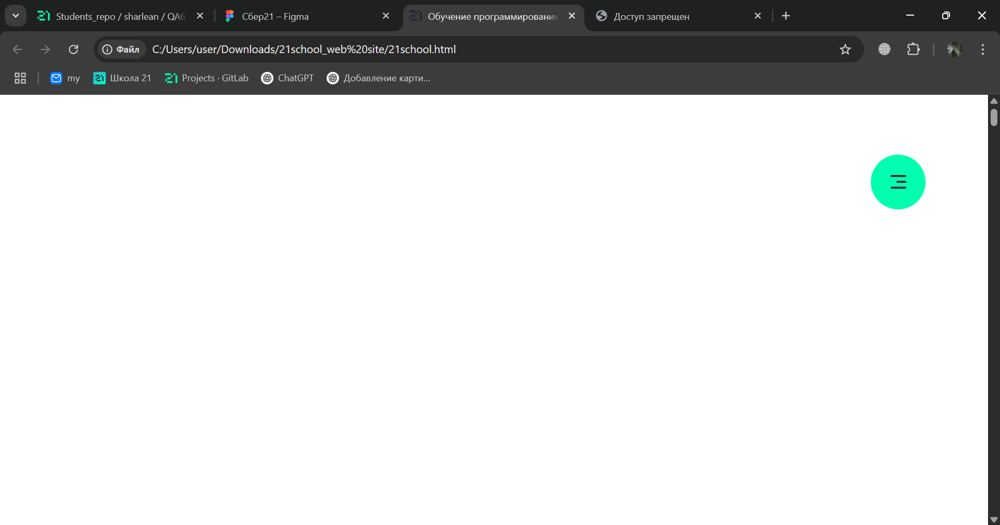
*  Скриншот ожидаемого вида из макета —  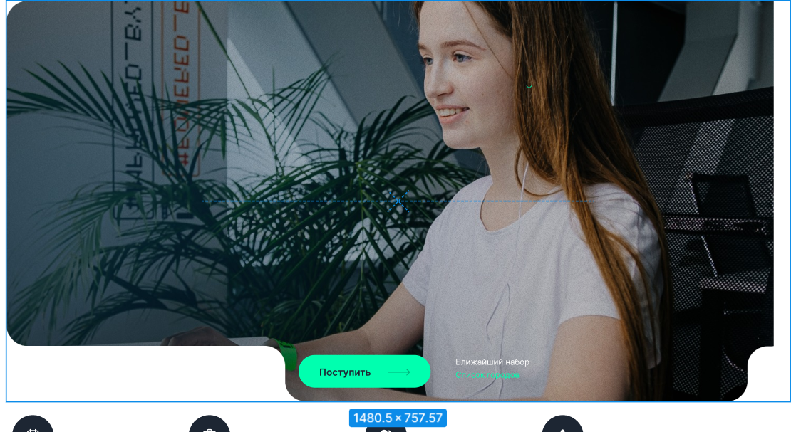

---

### 02. Отсутствует фоновый блок для статистики на главной странице

---

**Шаги для воспроизведения:**

1. Открыть локальную версию сайта
2. Пролистать до блока с заголовком:
   *«Помогаем раскрыть потенциал и готовим к успешной карьере в ИТ»*

---

**Ожидаемый результат:**
Блок с числовыми данными (6 000 и 100%) отображается на фоне тёмного прямоугольника со скруглёнными углами, как в макете (см. Figma, блок **Component 9**).

**Фактический результат:**
Фоновый блок отсутствует. Цифры и текст отображаются прямо на белом фоне страницы, что нарушает визуальную структуру и восприятие информации.

---

**Окружение:**

* **Устройство:** ноутбук
* **ОС:** Windows 11 Pro
* **Браузер:** Google Chrome 137.0.7151.104 (64 бит)

---

**Вложения:**

*  Скриншот текущего отображения (сайт) —  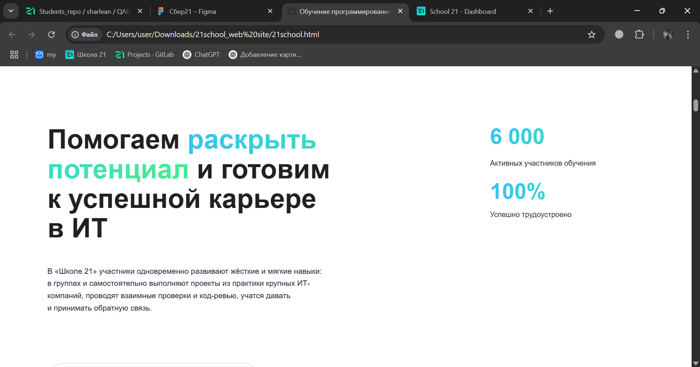
*  Скриншот ожидаемого вида из макета —  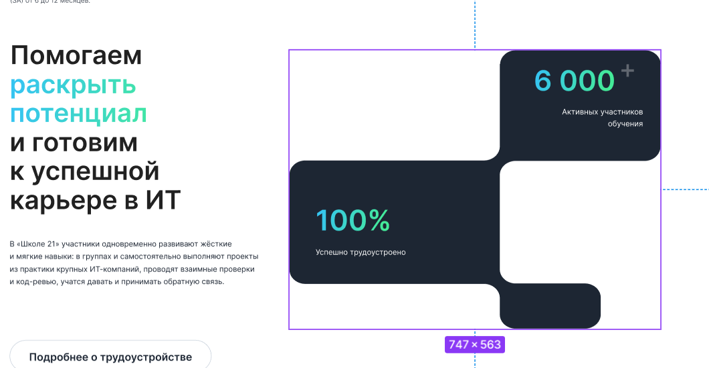

---
### 03.Углы в информационных блоках под направлениями  обучения не скруглены
---

**Описание:**
Углы в информационных блоках под направлениями «C/C++», «Алгоритмы» и «Языки программирования» не скруглены  

**Шаги для воспроизведения:**

1. Открыть локальную версию сайта
2. Пролистать до блока "Программа обучения" в колонках с направлениями обучения («Разработчик ПО», «QA-инженер» и т.д.)
3. Посмотреть на нижние прямоугольные блоки с названиями курсов и описаниями

---

**Ожидаемый результат:**
Каждый блок (например, «C/C++») имеет плавные, скруглённые углы, в том числе в области выреза, согласно макету в Figma.

**Фактический результат:**
Углы в нижней части блоков выглядят как прямые (острые), без скругления. Визуально это отличается от дизайна и делает блоки менее аккуратными.

---

**Окружение:**

* **Устройство:** ноутбук
* **ОС:** Windows 11 Pro
* **Браузер:** Google Chrome 137.0.7151.104 (64 бит)

---

**Вложения:**

*  Скриншот текущего отображения (сайт) —  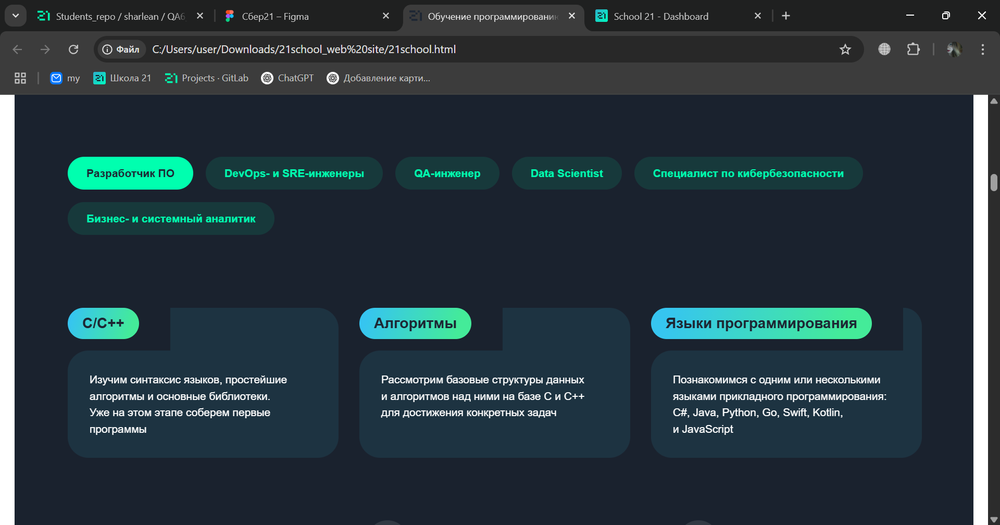
*  Скриншот ожидаемого вида из макета —  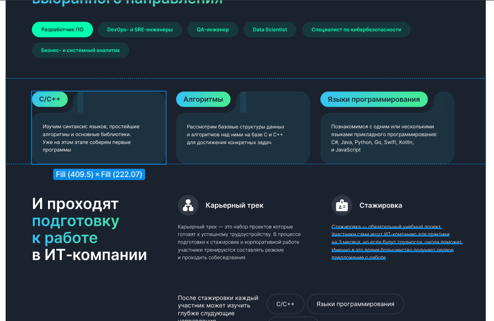

### 04.Несоответствие font-weight между макетом и сайтом
---

**Описание:**
В блоках "Карьерный трек" и "Стажировка" используется шрифт с font-weight: 600, в то время как в макете Figma указан font-weight: 300. Визуально текст выглядит значительно жирнее, чем предполагалось по дизайну.
**Шаги для воспроизведения:**

1. Открыть локальную версию сайта 
2. Пролистать дро блоков "Карьерный трек" и "Стажировка"
3. Обратить внимание на визуальное оформление заголовков и текста

---

**Ожидаемый результат:**
Шрифт должен быть установлен с font-weight: 300, как указано в макете Figma.
**Фактический результат:**
Шрифт выглядит жирным (font-weight: 600), что не соответствует дизайну.

---

**Окружение:**

* **Устройство:** ноутбук
* **ОС:** Windows 11 Pro
* **Браузер:** Google Chrome 137.0.7151.104 (64 бит)

---

**Вложения:**

*  Скриншот текущего отображения (сайт) —  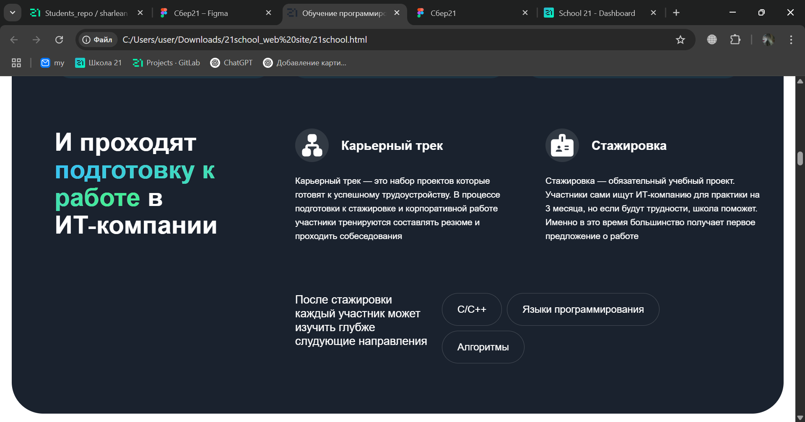
*  Скриншот ожидаемого вида из макета —  

### 05.Не загружается изображение в блоке «Начало обучения»
---

**Шаги для воспроизведения:**

1. Открыть локальную версию сайта 
2. Пролистать до блока в «В Школу 21 может поступить любой желающий»
3. Обратить внимание на битую картинку 
---

**Ожидаемый результат:**
Изображение должно отображаться, как указано в макете Figma.

**Фактический результат:**
Изображение не загружается, отображается как "битая картинка" (ошибка загрузки ресурса).

---

**Окружение:**

* **Устройство:** ноутбук
* **ОС:** Windows 11 Pro
* **Браузер:** Google Chrome 137.0.7151.104 (64 бит)

---

**Вложения:**

*  Скриншот текущего отображения (сайт) —  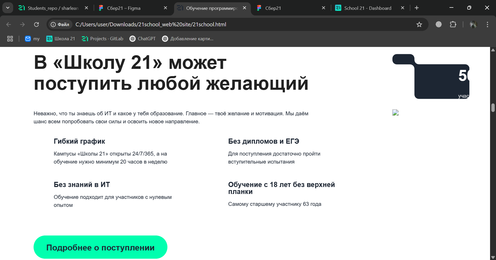
*  Скриншот ожидаемого вида из макета —  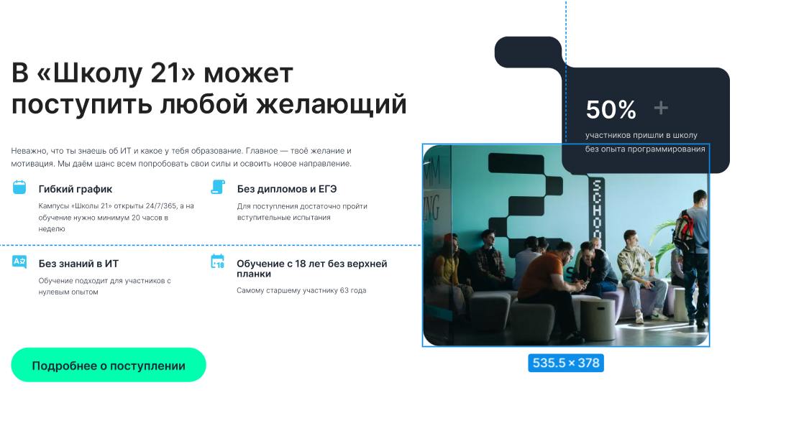

---

### 06.Некорректная форма верхнего правого угла контейнера блока "Программа обучения"
---

**Описание:**
У контейнера на этапа поступления  у всех четырёх углов должны быть одинаковые скругления. Однако верхний правый угол отличается — вместо внешнего скругления (выпуклого) он выглядит вогнутым, как будто скруглён внутрь. Это создаёт визуальный дисбаланс и не соответствует дизайну в Figma.

**Шаги для воспроизведения:**

1. Открыть локальную версию сайта 
2. Пролистать до блока "Прогрмма обучения"
3. Обратить внимание на форму угла контейнера 
---

**Ожидаемый результат:**
Все четыре угла должны иметь одинаковое внешнее скругление, как в макете Figma.

**Фактический результат:**
Верхний правый угол выглядит вогнутым (скругление внутрь), в отличие от остальных трёх углов, которые закруглены наружу.

---

**Окружение:**

* **Устройство:** ноутбук
* **ОС:** Windows 11 Pro
* **Браузер:** Google Chrome 137.0.7151.104 (64 бит)

---

**Вложения:**

*  Скриншот текущего отображения (сайт) —  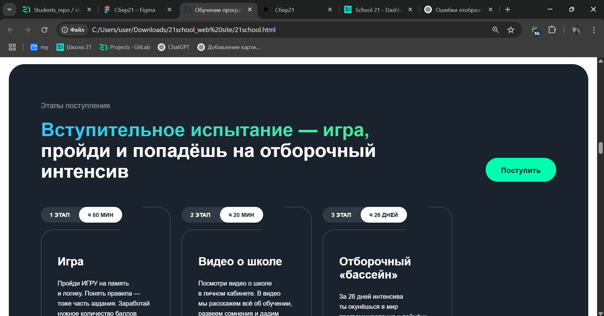
*  Скриншот ожидаемого вида из макета —  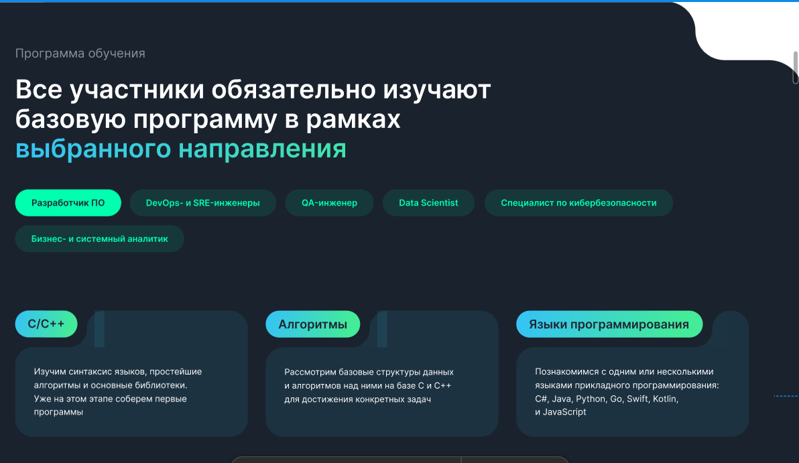

---
### 07.Не загружается изображение в блоке «Начало обучения»
---

**Шаги для воспроизведения:**

1. Открыть локальную версию сайта 
2. Пролистать до блока в «Начало обучения»
3. Обратить внимание на битую картинку 
---

**Ожидаемый результат:**
Изображение должно отображаться, как указано в макете Figma.
**Фактический результат:**
Изображение не загружается, отображается как "битая картинка" (ошибка загрузки ресурса).

---

**Окружение:**

* **Устройство:** ноутбук
* **ОС:** Windows 11 Pro
* **Браузер:** Google Chrome 137.0.7151.104 (64 бит)

---

**Вложения:**

*  Скриншот текущего отображения (сайт) —  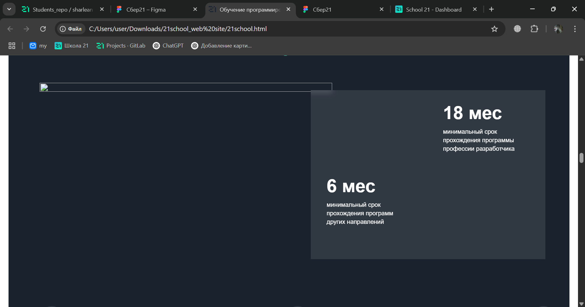
*  Скриншот ожидаемого вида из макета —  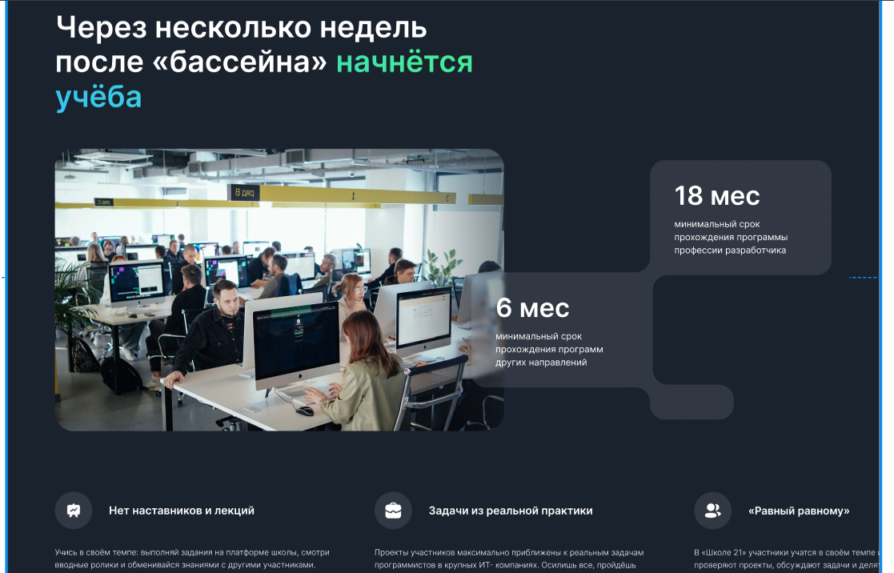

---
### 08.Не отображается эффект Overlay+OverlayBlur  в блоке «Начало обучения» 
---

**Описание:**
В блоке «Начало обучения» начнётся учёба» есть информационные блоки со сроками обучения 18 и 6 месяцев. Поверх фонового изображения должен применяться эффект затемнения (Overlay) с блюром (OverlayBlur). На сайте данный визуальный эффект отсутствует — изображение отображается без затемнения и размытия, в результате чего текст плохо читается и не соответствует дизайну.

--- 
**Шаги для воспроизведения:**

1. Открыть локальную версию сайта 
2. Пролистать до блока в «Через несколько недель после «бассейна» начнётся учёба»
3. Обратить внимание на битую картинку 
---

**Ожидаемый результат:**
Должен применяться эффект Overlay с размитием, как в Figma (например: полупрозрачный тёмный слой + backdrop blur), обеспечивающий читаемость текста.

**Фактический результат:**
Фоновое изображение отображается без эффекта затемнения и блюра.

---

**Окружение:**

* **Устройство:** ноутбук
* **ОС:** Windows 11 Pro
* **Браузер:** Google Chrome 137.0.7151.104 (64 бит)

---

**Вложения:**

*  Скриншот текущего отображения (сайт) —  
*  Скриншот ожидаемого вида из макета —  

---

### 09.Отсутствует горизонтальная прокрутка логотипов партнёров в нижнем блоке "Стажировка"
---

**Описание:**
В Figma в блоке с логотипами партнёров реализована карусель с горизонтальной прокруткой: отображается только 4 логотипа одновременно, а остальные можно пролистывать с помощью стрелок (навигационных кнопок слева и справа). На сайте карусель не реализована — отсутствуют как стрелки для листания, так и возможность скроллинга. В результате отображаются все логотипы сразу, что нарушает дизайн и перегружает блок. Также отсутствует затемнение (Overlay) за крайними логотипами, как в макете — вместо него серый блок выглядит, как просто рамка, и визуально выбивается.

--- 
**Шаги для воспроизведения:**

1. Открыть локальную версию сайта 
2. Перейти в нижнюю часть страницы, где размещены логотипы партнёров
3. Обратить внимание на отсутствие стрелок/кнопок для прокрутки
4. Обратить внимание, что отображаются сразу все логотипы, а не 5
5. Обратить внимание на внешний вид серого затемняющего блока — он отображается как рамка, без эффекта затемнения
---

**Ожидаемый результат:**
Отображаются только 5 логотипа одновременно и реализована горизонтальная прокрутка с помощью кнопок
Применён визуальный эффект затемнения по краям (Overlay + Blur), как в макете Figma

**Фактический результат:**
Нет кнопок/стрелок для горизонтальной прокрутки, все логотипы отображаются одновременно. Блок затемнения/Overlay выглядит как серый прямоугольник без размытия или градиента

---

**Окружение:**

* **Устройство:** ноутбук
* **ОС:** Windows 11 Pro
* **Браузер:** Google Chrome 137.0.7151.104 (64 бит)

---

**Вложения:**

*  Скриншот текущего отображения (сайт) —  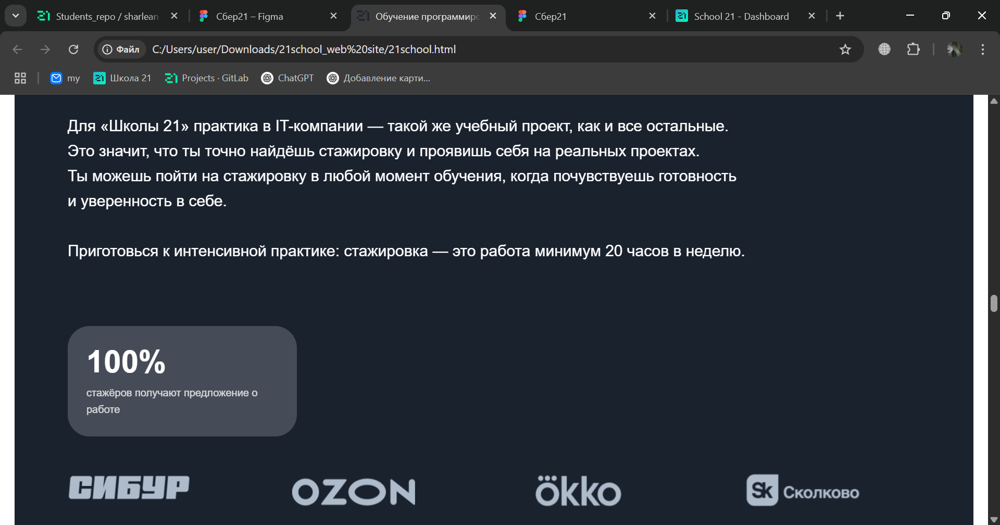
*  Скриншот ожидаемого вида из макета —  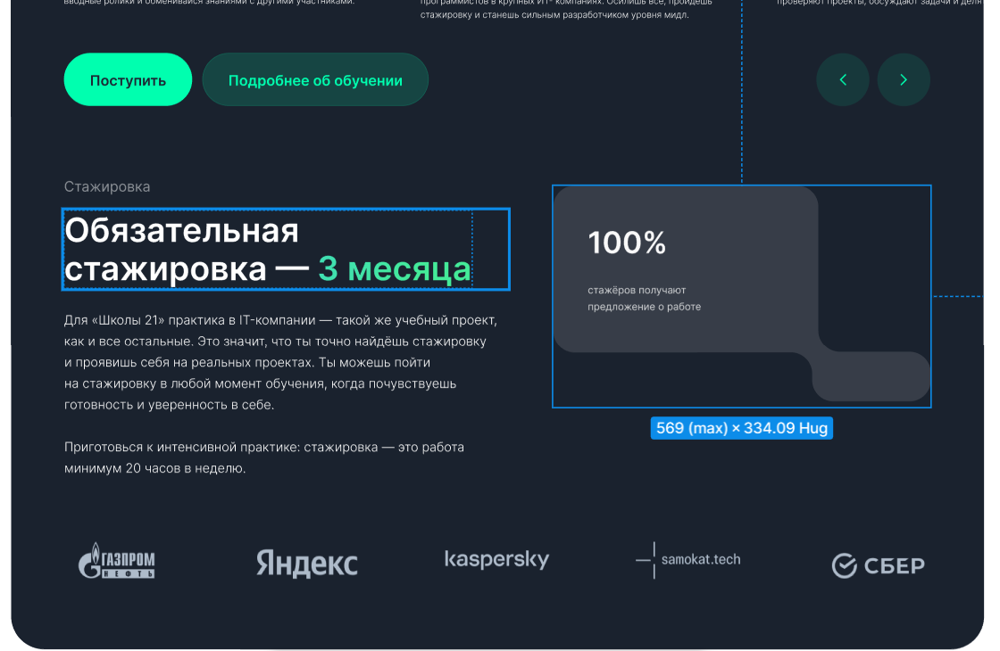

---

### 10.Присутствует кнопка "Подробнее о методике"
---

**Описание:**
В блоке "Прокачиваем не только профессиональные, но и мягкие навыки, которые ценятся на рынке в ИТ" присутсвует кнопка "Подробнее о методике" 
**Шаги для воспроизведения:**
1. Открыть локальную версию сайта 
2. "Прокачиваем не только профессиональные, но и мягкие навыки, которые ценятся на рынке в ИТ"
3. Обратить внимание на  присутсвие кнопки 
---

**Ожидаемый результат:**
Кнопка  "Подробнее о методике" отсутвует

**Фактический результат:** 
Отображаются кнопка  "Подробнее о методике" 

---

**Окружение:**

* **Устройство:** ноутбук
* **ОС:** Windows 11 Pro
* **Браузер:** Google Chrome 137.0.7151.104 (64 бит)

---

**Вложения:**

*  Скриншот текущего отображения (сайт) —  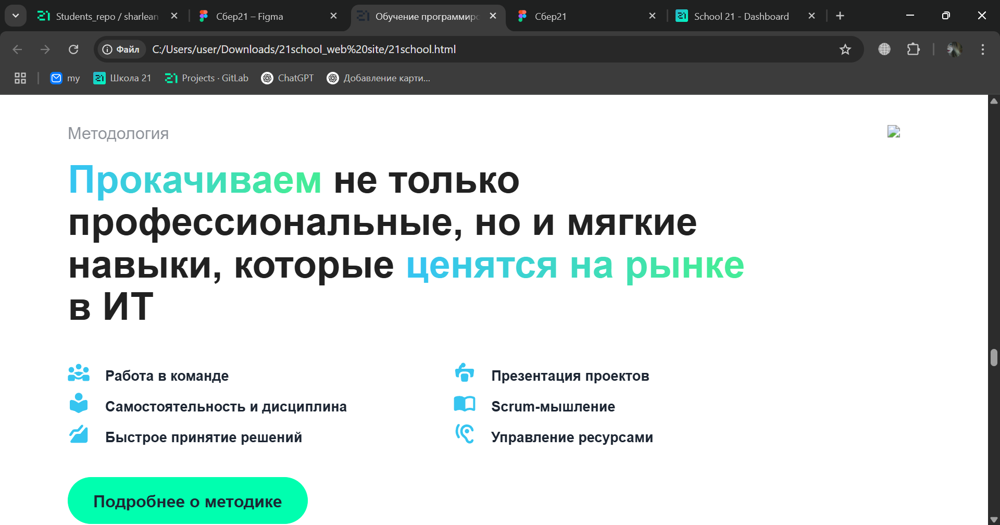
*  Скриншот ожидаемого вида из макета —  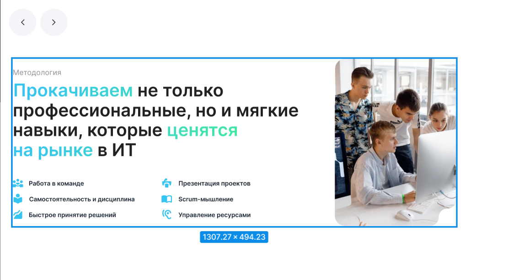

---

### 11.Не загружается изображение в блоке "Методология" 
---

**Шаги для воспроизведения:**

1. Открыть локальную версию сайта 
2. Пролистать до блока в "Методология" 
3. Обратить внимание на битую картинку 
---

**Ожидаемый результат:**
Изображение должно отображаться, как указано в макете Figma.
**Фактический результат:**
Изображение не загружается, отображается как "битая картинка" (ошибка загрузки ресурса).

---

**Окружение:**

* **Устройство:** ноутбук
* **ОС:** Windows 11 Pro
* **Браузер:** Google Chrome 137.0.7151.104 (64 бит)

---

**Вложения:**

*  Скриншот текущего отображения (сайт) —  
*  Скриншот ожидаемого вида из макета —  

---

### 12.Отсутвует блок "Кампусы"
---

**Шаги для воспроизведения:**

1. Открыть локальную версию сайта 
2. Пролистать до блока в "Прокачиваем не только профессиональные, но и мягкие навыки, которые ценятся на рынке в ИТ" 
3. Обратить внимание что под этим блоком пустое место 
---

**Ожидаемый результат:**
Должен отображаться блок "Кампусы" как указано в макете Figma.

**Фактический результат:**
Изображение не загружается, отображается как пустое поле.

---

**Окружение:**

* **Устройство:** ноутбук
* **ОС:** Windows 11 Pro
* **Браузер:** Google Chrome 137.0.7151.104 (64 бит)

---

**Вложения:**

*  Скриншот текущего отображения (сайт) —  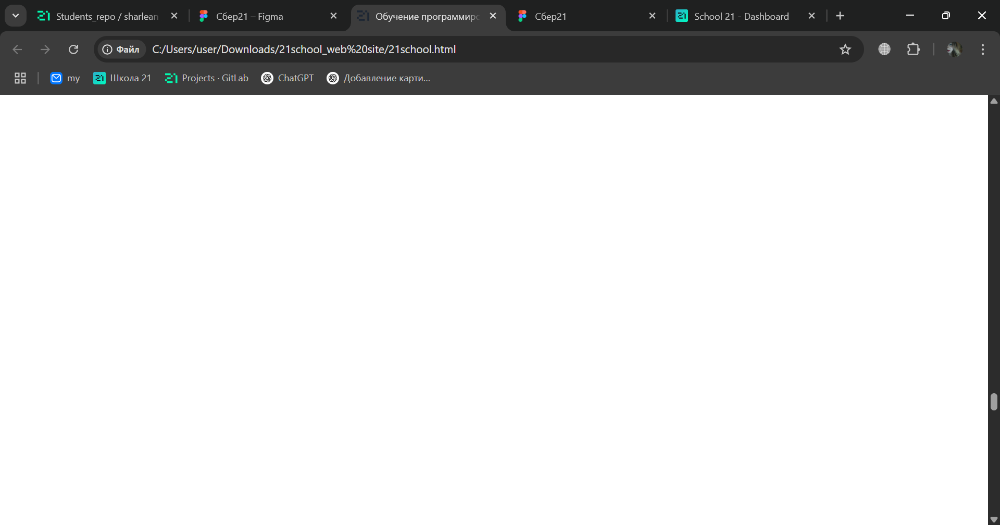
*  Скриншот ожидаемого вида из макета —  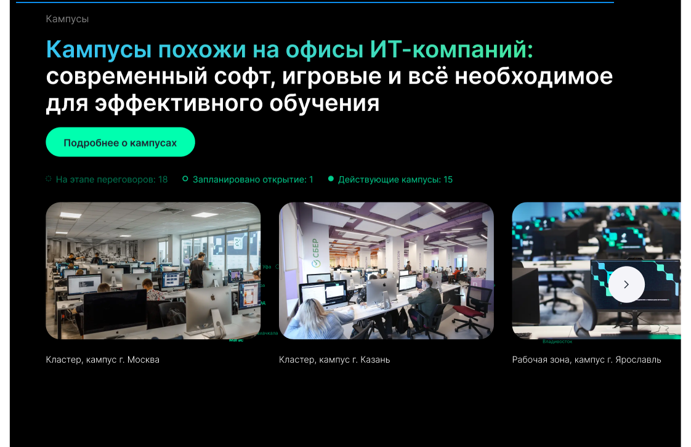

---

### 13.Некорректная форма верхнего правого угла контейнера
---

**Описание:**
У контейнера на "Заявка на поступление" у всех четырёх углов должны быть одинаковые скругления. Однако верхний правый угол отличается — вместо внешнего скругления (выпуклого) он выглядит вогнутым, как будто скруглён внутрь. Это создаёт визуальный дисбаланс и не соответствует дизайну в Figma.
**Шаги для воспроизведения:**

1. Открыть локальную версию сайта 
2. Пролистать до блока "Заявка на поступление"
3. Обратить внимание на форму угла контейнера 
---

**Ожидаемый результат:**
Все четыре угла должны иметь одинаковое внешнее скругление, как в макете Figma.

**Фактический результат:**
Верхний правый угол выглядит вогнутым (скругление внутрь), в отличие от остальных трёх углов, которые закруглены наружу.

---

**Окружение:**

* **Устройство:** ноутбук
* **ОС:** Windows 11 Pro
* **Браузер:** Google Chrome 137.0.7151.104 (64 бит)

---

**Вложения:**

*  Скриншот текущего отображения (сайт) —  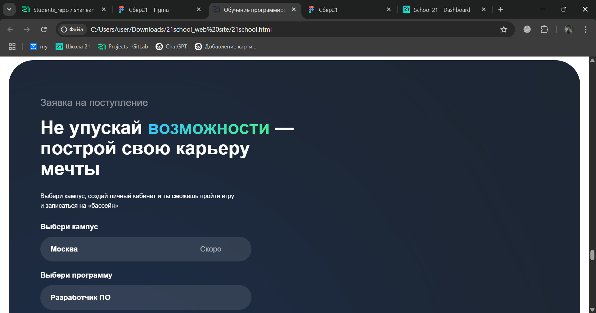
*  Скриншот ожидаемого вида из макета —  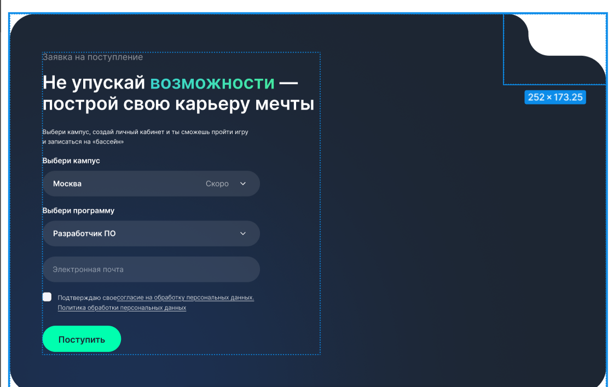

---

### 14.В подвале сайта отображется непредусмутренный макетом значок.
---

**Описание:**
У контейнера на "Заявка на поступление" у всех четырёх углов должны быть одинаковые скругления. Однако верхний правый угол отличается — вместо внешнего скругления (выпуклого) он выглядит вогнутым, как будто скруглён внутрь. Это создаёт визуальный дисбаланс и не соответствует дизайну в Figma.
**Шаги для воспроизведения:**

1. Открыть локальную версию сайта 
2. Пролистать до конца сайта 
3. Обратить внимание на правый нижный угол
---

**Ожидаемый результат:**
Оформление подвала сайта должно быть как в макете Figma.

**Фактический результат:**
Рядом с  надписью "Школа21" отображется значок.

---

**Окружение:**

* **Устройство:** ноутбук
* **ОС:** Windows 11 Pro
* **Браузер:** Google Chrome 137.0.7151.104 (64 бит)

---

**Вложения:**

*  Скриншот текущего отображения (сайт) —  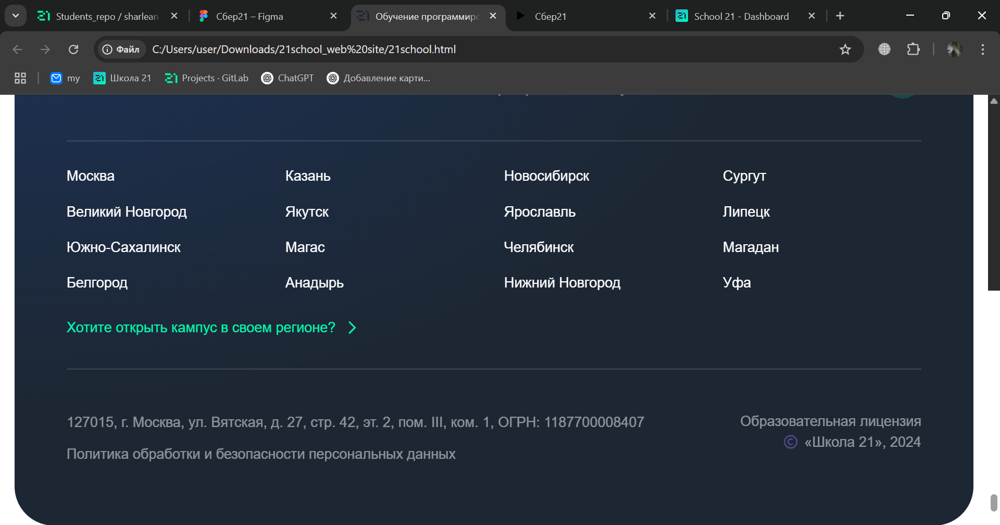
*  Скриншот ожидаемого вида из макета —  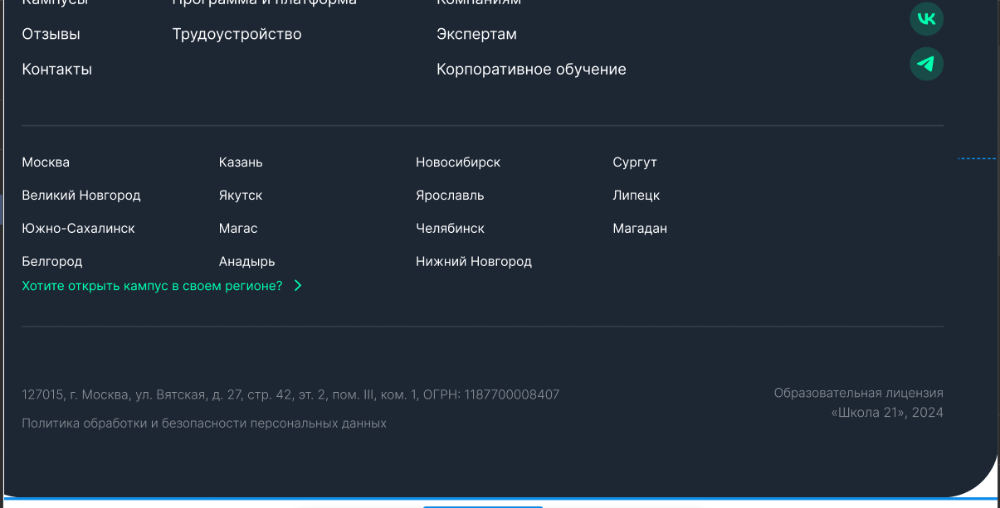

